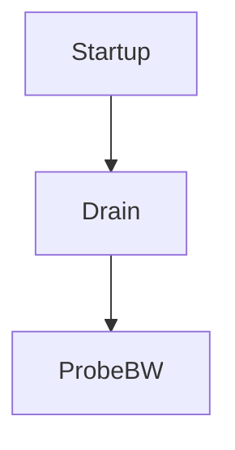

[Source](file:///D:/Program%20Files%20(x86)/New%20folder/bbr-2017-02-08-google-net-research-summit.pdf)
## Intuition
- Interpreting packet loss as congestion 
- When bottleneck buffers are large, loss-based congestion control keeps them full, causing [bufferbloat](BufferBloat.md).
- When bottleneck buffers are small, loss-based congestion control misinterprets loss as a signal of congestion, leading to low throughput.
- Using alternative metric as indicator for congestion
### Why does congestion occur
- Rate determing step is the bottleneck
- Consider an analogy to fluid flow through a pipe
	- RTProp : Round trip propagation time ~ Length of a physical pipe
	- BtlBw : Bottleneck bandwidth ~ Minimum diameter of the pipe
- [BDP Bandwidth delay product](BDP%20Bandwidth%20delay%20product.md) 
- Constraint lines intersect at inflight = BtlBw × RTprop, a.k.a. the pipe's BDP (bandwidth-delay product). Since the pipe is full past this point, the inflight - BDP excess creates a queue at the bottleneck, which results in the linear dependence of RTT on inflight data shown in the upper graph. Packets are dropped when the excess exceeds the buffer capacity.
- **BBR** : A distributed congestion-control protocol that reacts to actual congestion, not packet loss or transient queue delay, and converges with high probability to [Kleinrock](Kleinrock.md)'s optimal operating point.
## Identifying Bottleneck
- Aim : highest throughput $\uparrow$  & Lowest RTT/Delay $\downarrow$
- A connection runs with the highest throughput and lowest delay when (rate balance) the bottleneck packet arrival rate equals BtlBw and (full pipe) the total data in flight is equal to the BDP (= _BtlBw × RTprop_)
- Caveat : BtlBw and RTprop vary over the life of a connection, so they must be continuously estimated.
- [TCP](TCP.md) currently tracks RTT (the time interval from sending a data packet until it is acknowledged) since it's required for loss detection.
- but a good estimate results from tracking delivery rate. When the ack for some packet arrives back at the sender, it conveys that packet's RTT and announces the delivery of data inflight when that packet departed. Average delivery rate between send and ack is the ratio of data delivered to time elapsed: 
			_deliveryRate =_ _Δdelivered/Δt_       $\therefore deliveryRate<=bottleneckRate$
## Algorithm
1. When an ack is received
	Each ack provides new RTT and average delivery rate measurements that update the RTprop and BtlBw estimates.
2. When data is sent
	To match the packet-arrival rate to the bottleneck link's departure rate, BBR paces every data packet.
		- pacing_rate is BBR's primary control parameter.
		- cwnd_gain, bounds inflight to a small multiple of the BDP to handle common network and receiver pathologies
3. Steady-state behavior
	1. BBR minimizes delay by spending most of its time with one BDP in flight, paced at the BtlBw estimate. This moves the bottleneck to the sender so it can't observe BtlBw increases.
	2. BBR periodically spends an RTprop interval at a pacing_gain > 1, which increases the sending rate and inflight. If BtlBw hasn't changed, then a queue is created at the bottleneck, increasing RTT, which keeps deliveryRate constant. (This queue is removed by sending at a compensating pacing_gain < 1 for the next RTprop.)
	3. If BtlBw has increased, deliveryRate increases and the new max immediately increases the BtlBw filter output, increasing the base pacing rate. Thus, BBR converges to the new bottleneck rate exponentially fast.
- BBR uses the code  (Matching the Packet Flow to the Delivery Path) for everything, handling events by sequencing through a set of "states" that are defined by a table containing one or more fixed gains and exit criteria
### Single BBR Flow Startup Behaviour

- To handle Internet link bandwidths spanning 12 orders of magnitude, Startup implements a binary search for BtlBw by using a gain of 2/ln2 to double the sending rate while delivery rate is increasing. This discovers BtlBw in _log2BDP_ RTTs but creates up to _2BDP_ excess queue in the process.
- Once Startup finds BtlBw, BBR transitions to Drain, which uses the inverse of Startup's gain to get rid of the excess queue, then to ProbeBW once the inflight drops to a BDP.

## References
[ACM](https://queue.acm.org/detail.cfm?id=3022184)
[Benchmarking blog](https://atoonk.medium.com/tcp-bbr-exploring-tcp-congestion-control-84c9c11dc3a9)
[Spotify Engineering Blog](https://engineering.atspotify.com/2018/08/31/smoother-streaming-with-bbr/)
[Dropbox Engineering Blog](https://dropbox.tech/infrastructure/optimizing-web-servers-for-high-throughput-and-low-latency)
[Discussion Google Group](https://groups.google.com/g/bbr-dev)

#networking 
#congestioncontrol
#Bufferbloat 